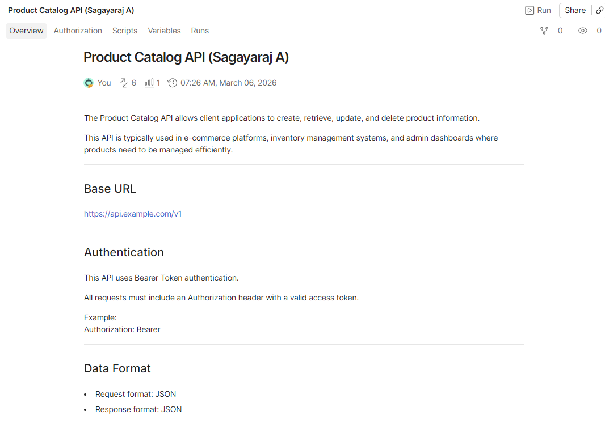
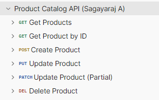
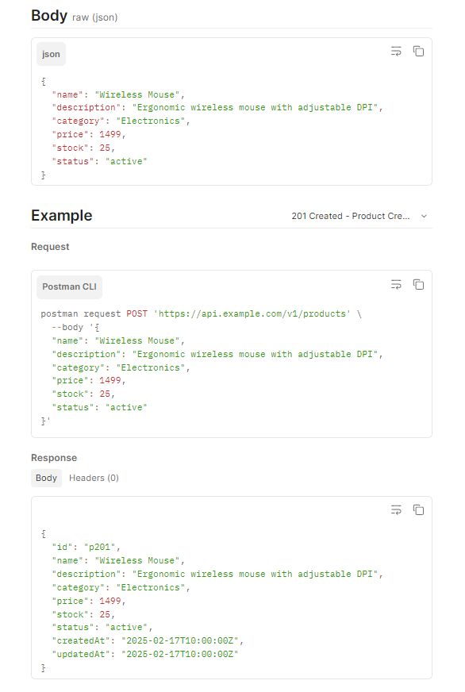

# Product Catalog API Documentation

This project provides documentation for a sample RESTful Product Catalog API.  
The API allows applications to create, retrieve, update, and delete product information.

---

## Project Purpose

This project demonstrates how to design and document a RESTful API using Postman.
The documentation includes authentication, request parameters, response examples, and common error responses.

---

## Tools Used

- Postman (API testing and documentation)
- GitHub (documentation hosting)
- REST API principles

---

## Base URL

https://api.example.com/v1

---

## Authentication

This API uses *Bearer Token Authentication*.

All requests must include the following header:

Authorization: Bearer <access_token>

---

## API Endpoints

### Get All Products
GET /products

Returns a list of products.

Example query parameters:

page – Page number  
limit – Number of products per page

---

### Get Product by ID
GET /products/{id}

Returns details of a single product.

---

### Create Product
POST /products

Creates a new product in the catalog.

---

### Update Product
PUT /products/{id}

Updates an existing product completely.

---

### Update Product (Partial)
PATCH /products/{id}

Updates specific fields of a product.

---

### Delete Product
DELETE /products/{id}

Deletes a product from the catalog.

---

## Full API Documentation

Postman Documentation:

https://documenter.getpostman.com/view/49265967/2sBXcKCy5s

## API Documentation Screenshots

### API Overview

### Endpoint Structure

### Create Product Example

---
